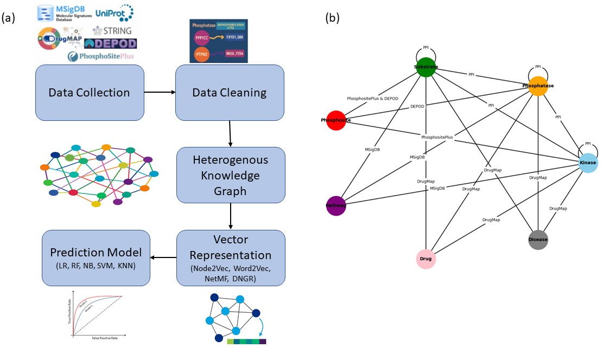

# PSNet: Knowledge Graph–Based Phosphatase–Substrate Association Prediction

PSNet is a computational framework for predicting phosphatase–substrate associations at the phosphosite level using a heterogeneous biological knowledge graph and network embedding–based machine learning.

---

## Overview

Protein phosphorylation and dephosphorylation are essential regulatory mechanisms in cellular signaling. While kinase–substrate associations have been widely studied, phosphatase–substrate relationships remain poorly characterized. PSNet addresses this gap by integrating heterogeneous biological data into a unified knowledge graph and leveraging network embeddings for prediction.

---

## Methodology

The PSNet framework consists of five main steps: data collection, data cleaning, knowledge graph construction, node embedding, and prediction modeling.

**Figure 1.**  
(a) Workflow of the PSNet framework, illustrating data collection, preprocessing, heterogeneous knowledge graph construction, vector representation learning, and prediction modeling.  
(b) Schematic representation of the heterogeneous knowledge graph, showing node types (phosphatases, kinases, substrates, phosphosites, pathways, drugs, and diseases) and their relationships.

---

### 1. Data Collection

Data are collected from multiple curated biological databases:
- DEPOD (2019): phosphatase–phosphosite associations  
- PhosphoSitePlus: kinase–substrate and phosphosite annotations  
- STRING: protein–protein interactions  
- MSigDB: pathway–gene associations  
- DrugMap (2023): gene–drug and gene–disease associations  
- UniProt: identifier mapping  

---

### 2. Data Cleaning

All datasets are standardized and filtered to:
- Remove missing or ambiguous identifiers  
- Harmonize gene and protein naming conventions  
- Remove isolated nodes  

---

### 3. Heterogeneous Knowledge Graph Construction

A heterogeneous knowledge graph is constructed where:
- Nodes represent phosphatases, kinases, substrates, phosphosites, pathways, drugs, and diseases  
- Edges represent biological relationships among these entities  

Phosphatase–substrate relationships are modeled at the phosphosite level.

---

### 4. Vector Representation (Node Embedding)

Low-dimensional node embeddings are learned using:
- Node2Vec  
- Word2Vec  
- NetMF  
- DNGR  

Experimentally validated phosphatase–phosphosite edges from DEPOD are removed prior to embedding computation to prevent information leakage.

---

### 5. Prediction Modeling

Node embeddings are used as features in supervised machine learning models:
- Logistic Regression  
- Random Forest  
- Naïve Bayes  
- Support Vector Machine  
- K-Nearest Neighbors  

Models are evaluated using stratified cross-validation and prioritization-based metrics.

---

## Repository Structure

---

## Notebooks Description

- **Preprocessing.ipynb**: data cleaning and identifier harmonization  
- **Knowledge_Graph.ipynb**: heterogeneous graph construction  
- **P_S.ipynb**: prediction experiments  
- **LOOCV.ipynb**: leave-one-out and prioritization analysis  

---

## Key Features

- Predicts candidate phosphatases for a given phosphosite  
- Covers approximately 250 human phosphatases  
- Integrates multi-relational biological data  
- Designed for experimental prioritization  

